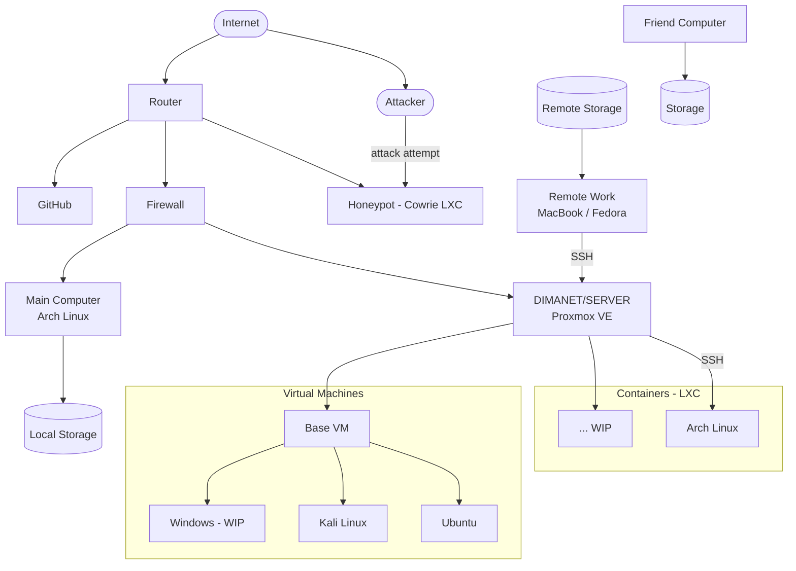

# dimaNet - Home Lab Server

## Custom Proxmox UI

---

## PICTURE FIRST PROTOTYPE HAND CREATION BELOW MERMID

## Infrastructure Overview

## Container in View

---

## About

Il progetto dimaNet nasce dall'esigenza di avere un ambiente centralizzato accessibile da remoto, indipendente dal dispositivo in uso. Gestione remota tramite DDNS e WireGuard, pentesting lab su rete isolata, e sperimentazione su virtualizzazione e sicurezza.

Sistema operativo host: **Proxmox VE 8.2** su bare metal.

### Accesso remoto
- WireGuard VPN
- DDNS per IP dinamico

### Link utili

- [Nvim config](https://github.com/MindfulLearner/josh-nvim-config)
- [Tmux config](https://github.com/MindfulLearner/dimaNet-Tmux-COnf)
- [pfSense hardening guide by Celes](https://github.com/celesrenata/pfsense-ultimate-config)

---

## Roadmap

Legenda: `done` `wip` `planned`

### 1. Web Server
- `wip` Apache/Nginx - hosting su VM o container LXC
- `wip` Stack LAMP/LEMP

### 2. Database Server
- `wip` MySQL / PostgreSQL / MongoDB
- `wip` Replica del database

### 3. File Server
- `wip` Samba
- `wip` NFS
- `wip` FTP/SFTP

### 4. Virtualizzazione e Container
- `done` Proxmox VE
- `wip` Docker
- `done` LXC

### 5. Gestione Cloud
- `done` OpenStack
- `wip` MAAS
- `wip` Juju

### 6. Servizi di Rete
- `wip` DNS (BIND)
- `wip` DHCP
- `wip` Proxy Server (Squid)

### 7. Mail Server
- `wip` Postfix / Dovecot
- `wip` SpamAssassin

### 8. Sicurezza e Monitoraggio
- `wip` Firewall (iptables/ufw)
- `wip` IDS (Snort/Suricata)
- `wip` Monitoring (Prometheus/Zabbix)

### 9. Ambiente di Sviluppo
- `wip` Git server
- `wip` CI/CD (Jenkins/GitLab CI)
- `wip` Node.js / Rails / Django

### 10. Media Server
- `wip` Plex / Emby
- `wip` Nextcloud

### 11. Backup
- `done` rsync + cron
- `done` Bacula

### 12. Automazione
- `done` Ansible
- `done` Shell scripting

### 13. VPN
- `done` WireGuard / OpenVPN

### 14. Game Server
- `planned` Minecraft / Counter-Strike

### 15. AI / ML
- `planned` TensorFlow / PyTorch

### 16. IoT
- `planned` MQTT Broker
