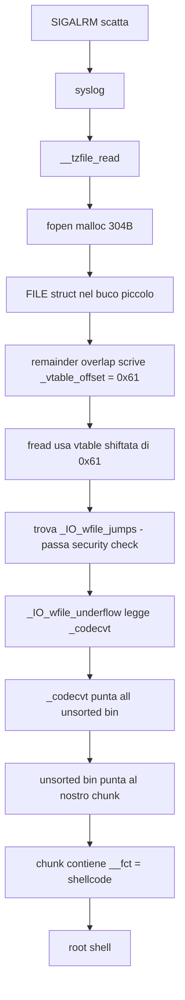

# CVE-2024-6387 - Study Notes

## Il bug in una frase

sshd chiama `syslog()` da un signal handler. `syslog()` chiama `malloc()`.
`malloc()` non e' rientrante. Se SIGALRM interrompe una `malloc()` gia'
in esecuzione, la seconda `malloc()` trova la heap in stato inconsistente
e legge dati controllati dall'attaccante.

---

## La struttura del tempo

```
t=0s        connessione TCP aperta, countdown 120s inizia
t=0-119s    noi prepariamo la heap di sshd (grooming)
t=119.9s    mandiamo l'ultimo pacchetto che fa partire malloc() in sshd
t=120.0s    SIGALRM scatta, syslog() chiama malloc() su heap corrotta
            -> shellcode eseguito come root
```

---

## Cosa succede nella heap (il cuore dell'exploit)

### Step 1 - Creiamo dei buchi (pacchetti a, b, c, d)

Mandiamo pacchetti SSH crafted che fanno fare a sshd `malloc()` e `free()`
in sequenza. Il risultato e' 27 coppie di buchi nella heap:

```
[muro][  buco grande ~8KB  ][muro][buco piccolo ~320B][muro]  x27
```

Dentro ogni **buco piccolo** scriviamo i nostri dati (layout reale i386: vedi `attempts/32bit-debian-12-v4/README.md`):
- fake vtable shiftata / `_IO_wfile_jumps`
- `_codecvt` → tipicamente `bins[78]` (smallbin 320) su i386, non solo testa unsorted

### Step 2 - Apriamo le race windows (pacchetto e)

L'ultimo pacchetto fa fare a sshd `malloc(~4KB)` che deve splittare
il buco grande in due pezzi:

```
[pezzo allocato ~4KB] + [remainder ~4KB]
```

glibc fa questa operazione in due momenti separati:
1. Linka il remainder nella lista dei chunk liberi
2. Scrive il size del remainder

Se SIGALRM scatta TRA il punto 1 e il punto 2:
- il remainder e' gia' linkato ma il suo `size` non e' ancora scritto
- il `size` contiene i nostri dati lasciati prima (attacker-controlled)
- lo mettiamo grande abbastanza da coprire il buco piccolo vicino

### Step 3 - SIGALRM scatta (t=120s)

```
SIGALRM -> syslog() -> __tzfile_read() -> fopen("/etc/localtime")
```

`fopen()` chiama `malloc(304)` per allocare una struttura FILE.
glibc trova il buco piccolo libero e ci mette la FILE struct.

MA il remainder gonfiato si sovrappone al buco piccolo.
Quando glibc splitta il remainder per dare spazio alla FILE struct,
il puntatore interno `bk` del remainder (valore `0xb761d7f8`)
va a sovrascrivere un byte della FILE struct appena allocata.

Il terzo byte di `0xb761d7f8` e' `0x61`. Questo byte atterra su
`_vtable_offset` della FILE struct.

### Step 4 - La FILE struct viene processata

`fread()` legge il timezone file. glibc usa la FILE struct per sapere
quale funzione chiamare. Con `_vtable_offset = 0x61`, glibc guarda
la vtable in una posizione diversa dal normale: trova `_IO_wfile_jumps`
(che noi avevamo scritto nel buco piccolo).

`_IO_wfile_jumps` e' una vtable legittima di glibc: passa i security check.

Quella vtable porta a `_IO_wfile_underflow()`, che legge `_codecvt`.

`_codecvt` (scritto da noi nel buco piccolo) punta all'unsorted bin
di glibc. L'unsorted bin contiene un puntatore a uno dei nostri
chunk liberati nella heap. Quel chunk contiene il nostro shellcode.

Shellcode eseguito come root.

---

## Schema visivo della catena



---

## I numeri che contano (offset glibc i386, base 0xb7400000)

| Cosa | Offset | Perche' |
|---|---|---|
| `_IO_wfile_jumps` | `+0x21b740` | vtable wide-char, unica che passa `IO_validate_vtable()` |
| unsorted bin (`_codecvt` target) | `+0x21d7f8` | contiene puntatore al nostro chunk con shellcode |
| `_vtable_offset` scritto | `0x61` | terzo byte di `0xb761d7f8` (il bk del remainder) |

---

## Perche' funziona su Debian 12.5.0 i386

Su i386, un bug dell'ELF loader fa si' che glibc si mappi SEMPRE
a uno di soli due indirizzi: `0xb7200000` oppure `0xb7400000`.

Probabilita' di indovinare: **50% per tentativo**.

Con 100 connessioni parallele: ~6-8 ore per ottenere una shell root.

---

## Cosa rende questo exploit difficile

1. **La race** - SIGALRM deve scattare in una finestra di microsecondi
   dentro `_int_malloc()`. Con 27 race windows consecutive, in media
   ci vogliono ~10.000 tentativi.

2. **Il grooming** - la heap di sshd deve avere esattamente il layout
   giusto. 27 coppie di buchi, con i dati corretti scritti dentro,
   stabilizzati nei bin. Qualys ci ha impiegato settimane.

3. **L'unsorted bin** - `_codecvt` non e' un simbolo statico in glibc.
   Va costruito indirettamente puntando all'unsorted bin, che a sua
   volta punta al nostro chunk con lo shellcode.
