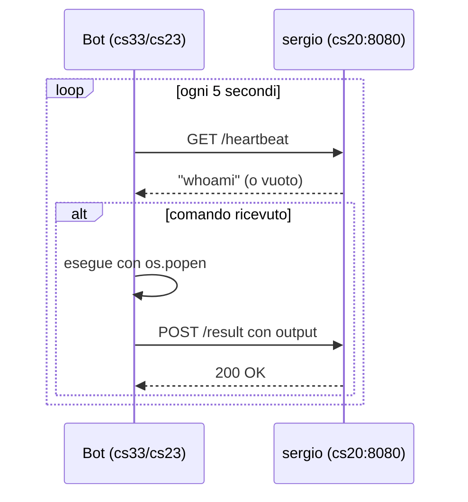

# HTTP Polling + Seed Server - Architettura

## Concetto: Beaconing

Il bot fa un loop infinito contattando il sergio ogni N secondi per ricevere comandi e inviare risultati. Questo pattern si chiama **beaconing**.

Il bot si connette sempre verso l'esterno (outbound). Questo permette di attraversare firewall e NAT normalmente.

## Concetto: Seed Server

Ogni bot, appena avviato, apre un mini HTTP server su :9090 che serve `bedbug.py`. Quando una nuova vittima viene raggiunta, scarica `bedbug.py` direttamente dal bot piu vicino, non dal sergio. Il sergio resta nascosto dalla propagazione laterale.

## Flusso beacon (ciao.py)

## Endpoints sergio (sergio.py su cs20:8080)

| Endpoint | Metodo | Funzione |
|----------|--------|----------|
| `/` | GET | sergio dashboard bots connessi |
| `/heartbeat` | GET | check-in bot, restituisce comando in coda |
| `/result` | POST | riceve output del comando eseguito |
| `/command` | POST | imposta comando dalla dashboard |

## Porte nel lab

| Porta | Chi | Funzione |
|-------|-----|----------|
| :8080 | cs20 | sergio |
| :8081 | cs20 | file server (serve ciao.py) |
| :9090 | ogni bot | seed server (serve bedbug.py) |

## Command Consumption

Il sergio usa `pending_command` in memoria. Al primo check-in il comando viene consegnato e la coda svuotata, cosi non viene ri-eseguito al beacon successivo.

## Stato (testato 2026-04-03)

- [x] beacon heartbeat funzionante (cs33 -> cs20)
- [x] seed server su ciao.py (SEED_PORT + PAYLOAD_PORT dinamici)
- [x] propagazione cs33 -> cs23 funzionante
