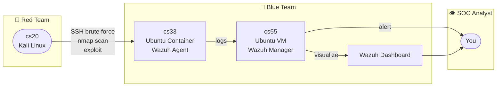

# Project #1: Build Your Own SOC (SIEM Lab)

## Machines

| Name | Type | OS | Role |
|------|------|----|------|
| cs20 | VM | Kali Linux | Attacker — Red Team |
| cs33 | Container | Ubuntu | Victim — Wazuh Agent (user: `swagvict`, password: `victim`) |
| cs55 | VM | Ubuntu | Wazuh Manager + Dashboard |

---

## Architecture

---

## Checklist

- [x] cs55 — install Wazuh Manager + Dashboard + Indexer (all-in-one script)
- [x] cs33 — install Wazuh Agent, connect to cs55
- [x] cs20 — first attack: SSH brute force with Hydra + nmap scan
- [x] verify alerts on Wazuh Dashboard

## Startup sequence (mandatory order)

1. cs55: `wazuh-indexer` → `wazuh-manager` → `wazuh-dashboard`
2. cs33: `wazuh-agent`

> All services are enabled with `systemctl enable` — they start automatically on boot.
