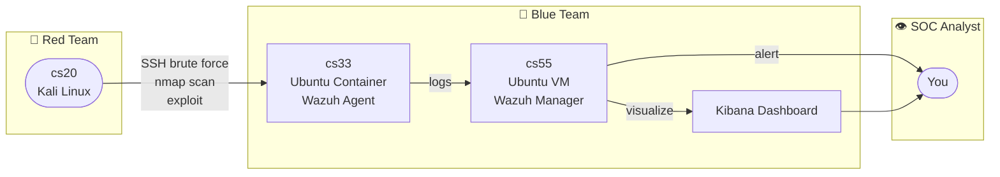

# Project #1: Build Your Own SOC (SIEM Lab)

## Machines

| Name | Type | OS | Role |
|------|------|----|------|
| cs20 | VM | Kali Linux | Attacker — Red Team |
| cs33 | Container | Ubuntu | Victim — Wazuh Agent |
| cs55 | VM | Ubuntu | Wazuh Manager + Kibana |

---

## Architecture

---

## Next Steps

- [ ] cs55 — installare Wazuh Manager + Kibana
- [ ] cs33 — installare Wazuh Agent, collegarlo a cs55
- [ ] cs20 — primo attacco: brute force SSH con Hydra + nmap scan
- [ ] verificare alert su Kibana
