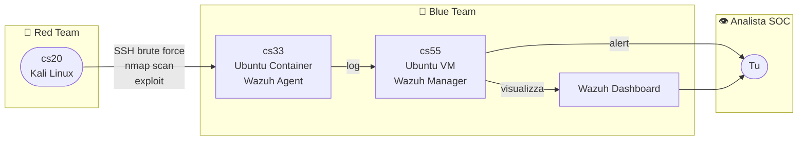

# Progetto #1: Costruisci il tuo SOC (SIEM Lab)

## Macchine

| Nome | Tipo | OS | Ruolo |
|------|------|----|-------|
| cs20 | VM | Kali Linux | Attaccante - Red Team |
| cs33 | Container | Ubuntu | Vittima - Wazuh Agent (utente: `swagvict`, password: `victim`) |
| cs55 | VM | Ubuntu | Wazuh Manager + Dashboard |

---

## Architettura

---

## Checklist

- [x] cs55 - installare Wazuh Manager + Dashboard + Indexer (script all-in-one)
- [x] cs33 - installare Wazuh Agent, collegarlo a cs55
- [x] cs20 - primo attacco: brute force SSH con Hydra + nmap scan
- [x] verificare alert su Wazuh Dashboard

## Sequenza di avvio (ordine obbligatorio)

1. cs55: `wazuh-indexer` → `wazuh-manager` → `wazuh-dashboard`
2. cs33: `wazuh-agent`

> Tutti i servizi sono abilitati con `systemctl enable` - partono automaticamente all'accensione.
